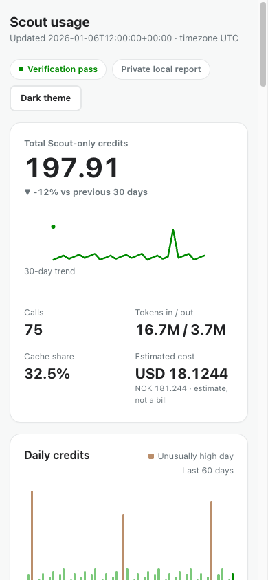

# Scout Usage Tracker

See how many credits Microsoft Scout uses — locally, privately, and independently from your account-wide GitHub Copilot total.

The tracker reads Scout's local usage ledger, keeps a private history in case Scout later removes old events, and generates one standalone HTML dashboard. It does not upload data, start a web server, or require a cloud account.


> The screenshots and included example use fictional data. Your generated dashboard stays on your computer and may contain private usage information, so review it before sharing.

## Easiest installation: ask your coding agent

This is the simplest option for people using **Codex**, **Claude Code**, or **GitHub Copilot** locally. Open your preferred agent on the Mac where Scout is installed and paste the prompt below.

If the agent is running remotely, it cannot safely access Scout's local database. It should guide you to use a local agent instead — never ask you to upload `session-store.db`.

<details open>
<summary><strong>Copy this installation prompt</strong></summary>

```text
Install or update Scout Usage Tracker from:
https://github.com/Christoffer91/scout-usage-tracker

Work locally on this computer. Before changing anything:
1. Read the repository README, install.sh, uninstall.sh, and config.example.json.
2. Confirm Python 3.10 or newer is available with Python sqlite3 support.
3. Check whether ~/.scout/copilot/session-store.db exists. Open it read-only only; never modify it.
4. If this agent is running remotely and cannot access the local Scout installation, stop. Do not ask me to upload the database.

Safety requirements:
- Do not use sudo.
- Do not upload, copy into the repository, print, or expose Scout's database or private usage data.
- Do not enable automatic/background updates without asking me first.
- Keep per-session reporting disabled unless I explicitly opt in.
- Do not add account-wide Copilot totals, currency rates, or price estimates unless I provide them and approve their use.
- Preserve an existing config and history database. Use the installer's idempotent update path when already installed.

Then:
1. Clone or update the repository in a sensible user-owned folder.
2. Run the repository's local tests and privacy checks before installation.
3. Run ./install.sh install for a new install, or ./install.sh update for an existing install.
4. Run ~/.local/bin/scout-usage status.
5. Run ~/.local/bin/scout-usage update.
6. Open the generated dashboard with ~/.local/bin/scout-usage open.
7. Report what was installed, the dashboard path, verification status, and any warnings without revealing private event data.

If any requirement fails, diagnose it safely and explain the smallest corrective action. Do not weaken the privacy protections.
```

</details>

## What you get

- Exact Scout-only credits from Scout's local `total_nano_aiu` ledger.
- Daily, ISO-weekly, monthly, and per-model breakdowns.
- Independent verification using `token_details_json`.
- A private SQLite history with incremental, duplicate-safe imports.
- A responsive light/dark dashboard with no external assets or network requests.
- Optional anonymized session reporting, cost estimates, and account-wide comparison — all disabled or empty by default.

<p align="center">
  
</p>

## Manual installation

Requirements: Python 3.10 or newer with SQLite support, plus a local Scout database at the default location `~/.scout/copilot/session-store.db`.

```sh
git clone https://github.com/Christoffer91/scout-usage-tracker.git
cd scout-usage-tracker
./install.sh install
${HOME}/.local/bin/scout-usage status
${HOME}/.local/bin/scout-usage update
${HOME}/.local/bin/scout-usage open
```

The installer:

- uses no `sudo`;
- installs under your home directory;
- preserves an existing configuration and history;
- does not create a background job by default;
- can be run repeatedly without duplicating usage events.

Update an existing installation from a newer checkout:

```sh
git pull --ff-only
./install.sh update
${HOME}/.local/bin/scout-usage update
```

## Understanding the numbers

**Scout-only credits are exact.** They come from events stored by Scout on this computer:

```text
credits = Decimal(total_nano_aiu) / 1,000,000,000
```

**GitHub Copilot Admin totals are account-wide.** They can include usage from Scout and other Copilot clients, so the tracker never treats them as Scout-only usage.

**USD and NOK values are estimates, not bills.** The database does not necessarily contain the amount actually charged. Your billed amount may be zero when usage is covered by included credits. Unknown model prices display `—` instead of being guessed.

## Privacy by default

Scout's source database is opened using SQLite read-only mode, a bounded busy timeout, and `PRAGMA query_only=ON`.

The tracker never stores:

- prompts or session summaries;
- raw session IDs;
- raw `token_details_json`;
- Scout database paths or source row IDs;
- telemetry or data on an external service.

Runtime directories use mode `0700`. Config, the HMAC secret, history database, dashboard, and logs use mode `0600`. Text inserted into the dashboard is HTML-escaped, and the generated file has a restrictive Content Security Policy.

Session reporting is off by default. If explicitly enabled, sessions use short HMAC-derived labels rather than raw identifiers. The HTML dashboard is still private usage metadata: review it before sharing.

## Configuration

The first install creates `~/.config/scout-usage-tracker/config.json` from [config.example.json](config.example.json) without overwriting an existing file.

<details>
<summary><strong>Configuration reference</strong></summary>

- `source_database`: Scout's local SQLite database.
- `history_database`: the tracker's private retained history.
- `dashboard_path`: where the standalone HTML report is written.
- `timezone`: `local` or an IANA zone such as `Europe/Oslo`.
- `privacy.include_sessions`: defaults to `false`; enables only anonymized session labels.
- `usd_per_credit_by_model`: optional model-specific USD-per-credit estimates.
- `usd_to_nok`: optional manually supplied exchange rate.
- `account_comparison`: optional manual account-wide Copilot `total`, `additional_usage_usd`, `as_of`, and `scope`.

Unknown models never receive a guessed cost. A total estimate appears only when every active model has a configured rate. Legacy camelCase keys are migrated safely when needed.

</details>

## Optional automatic refresh on macOS

First verify that a manual update succeeds. Then opt in explicitly:

```sh
./install.sh install --enable-auto-update
launchctl print gui/$(id -u)/local.scout-usage-tracker
```

This installs a user-level LaunchAgent and verifies it with `launchctl print`. It uses no `sudo`, `pkill`, or `killall`. macOS privacy controls may require granting file access to the process running the agent.

Install the optional Codex skill separately:

```sh
./install.sh install --install-skill
```

## Troubleshooting

Run:

```sh
${HOME}/.local/bin/scout-usage status
${HOME}/.local/bin/scout-usage update
```

The status command distinguishes missing, locked, permission-denied, corrupt, and schema-incompatible Scout databases.

- **Scout database missing:** open and use Scout first, then check `~/.scout/copilot/session-store.db`.
- **Permission denied on macOS:** allow the terminal or local coding agent to access the folder containing Scout's database.
- **Database locked:** close any process holding an exclusive database lock and retry. The tracker never modifies Scout's database.
- **Verification warning:** read the dashboard's Verification card. Invalid or missing token details are reported; authoritative credits still use stored `total_nano_aiu`.
- **Possible history gap:** the local Scout ledger may have removed older source events before the tracker imported them. Existing retained history is not deleted.

## Uninstall

Preserve configuration, history, and generated reports:

```sh
./install.sh uninstall
# or
./uninstall.sh
```

Remove tracker-owned data as well:

```sh
./install.sh uninstall --purge-data
```

The uninstall procedure removes only enumerated tracker-owned files and refuses unsafe or unowned locations.

## For maintainers and coding agents

The implementation uses only the Python standard library. Keep the product local-only: no telemetry, external dashboard dependencies, implicit background jobs, raw identifiers, or Scout database writes.

Run the complete local verification before proposing or publishing changes:

```sh
PYTHONPATH=src python3 -m unittest discover -s tests -p 'test_*.py' -v
python3 -m compileall -q src scripts tests
sh -n install.sh uninstall.sh
PYTHONPATH=src python3 scripts/generate_synthetic.py --check
git diff --check
```

To regenerate the fictional example after an intentional dashboard change:

```sh
PYTHONPATH=src python3 scripts/generate_synthetic.py
```

## Calculation verification

For each event, the tracker independently recalculates nano-AIU as:

```text
recalculated_nano_aiu = sum(Decimal(tokenCount) * Decimal(costPerBatch) / Decimal(batchSize))
```

Numbers must be finite; token counts and costs must be nonnegative; batch size must be positive. A difference of at most 0.5 nano-AIU verifies. Missing or invalid JSON is reported explicitly. Negative stored totals are retained as authoritative adjustments while token counts remain nonnegative.

## Limitations

- This is ledger accounting, not a billing API.
- Currency rates and prices are user-supplied estimates.
- Source-gap detection is heuristic because raw source row IDs are not retained.
- Event-level model attribution assigns the whole event to its recorded model.
- The dashboard refreshes only when the tracker runs; it does not start a local server.
