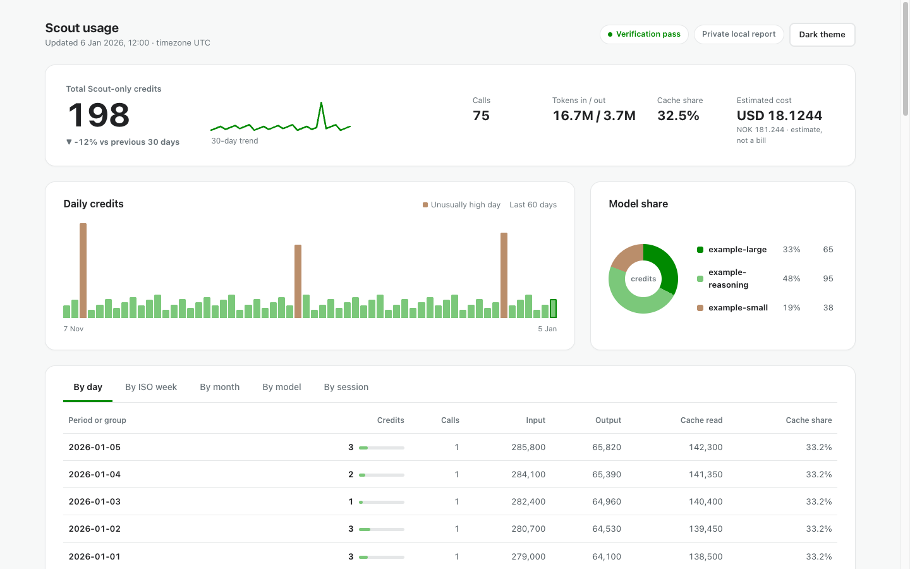

# Scout Usage Tracker

See how many AI credits Microsoft Scout uses—locally, privately, and separately from your account-wide GitHub Copilot usage.

The tracker reads Scout's local ledger in read-only mode, retains a private SQLite history, and generates one standalone HTML dashboard. It sends no telemetry, starts no persistent or externally listening server, and needs no cloud account. On Windows, an explicitly requested `/cost` report can start the bounded `127.0.0.1` viewer described below.

**Desktop only:** Scout and this tracker run locally on Windows or macOS. There is no mobile installation or mobile dashboard workflow.



> The screenshot uses fictional data. Your dashboard stays on your computer and can contain private usage metadata; review it before sharing.

## Quick start: ask your local agent

The same prompt works in **Microsoft Scout**, **Codex**, **Claude Code**, and the **GitHub Copilot app**. The agent must have local terminal and file access on the Windows or macOS computer where Scout is installed. A web-only or remote agent cannot install against Scout's local database and must never ask you to upload it.

<details open>
<summary><strong>Copy this installation prompt</strong></summary>

```text
Install or update Scout Usage Tracker from:
https://github.com/Christoffer91/scout-usage-tracker

You may be running inside Microsoft Scout, Codex, Claude Code, or the GitHub Copilot app.
Work only on this computer. If you do not have local terminal and file access, stop and explain
that limitation; never ask me to upload Scout's database.

Detect Windows or macOS and whether this is a new or tracker-owned existing installation.
Acquire the repository with Git if available. If Git is unavailable, download GitHub's source
ZIP from https://github.com/Christoffer91/scout-usage-tracker/archive/refs/heads/main.zip
into a temporary directory instead; do not install Git or a package manager.
Read README.md, config.example.json, and the relevant installer and uninstaller before acting.
Verify Python 3.10+ with sqlite3 and check whether Scout's local session-store.db exists.

Privacy and safety:
- Open Scout's database read-only; never print, upload, modify, or copy it into the repository.
- Never print prompts, responses, session IDs, private paths, configuration values, or usage totals.
- Do not use administrator privileges or sudo.
- Do not enable background updates, session reporting, billing sync, account-wide integrations,
  or price overrides without explicit approval.
- Preserve any existing config and history database.

Run the repository tests and privacy checks before installation.

For a new installation:
- Ask whether estimates should show USD only (default) or an optional secondary currency.
- For a secondary currency, ask for its three-letter code and the manual rate: 1 USD equals X.
- Windows USD only: run .\install.ps1 install -InstallScoutSkill -UsdOnly.
- Windows secondary currency example: .\install.ps1 install -InstallScoutSkill -Currency EUR -UsdRate 0.92.
- macOS USD only: run ./install.sh install --install-scout-skill --usd-only.
- macOS secondary currency example: ./install.sh install --install-scout-skill --currency EUR --usd-rate 0.92.

For an existing tracker-owned installation, use the equivalent update action with the same skill
option. Preserve existing configuration, history, optional settings, and dashboard location.
Then run status, refresh the tracker once, open the generated dashboard locally, and verify the
installed launcher. Do not create a background job.

Report only PASS/FAIL and non-sensitive warnings. After success, tell me to start a new Scout
conversation and use /cost.
```

</details>

## What you get

- Exact Scout-only credits from `total_nano_aiu`.
- Daily, ISO-weekly, monthly, and per-model totals with interactive model filtering.
- Independent AIU verification from `token_details_json`.
- Incremental, duplicate-safe private history in SQLite.
- A self-contained light/dark desktop dashboard that adapts to different window widths.
- Optional `/cost`, anonymized chat drill-downs, estimates, and account-wide comparisons.

## Install manually

Requirements: Python 3.10+ with SQLite and a local Scout database (`%USERPROFILE%\.scout\copilot\session-store.db` on Windows or `~/.scout/copilot/session-store.db` on macOS/POSIX).

### Windows (ARM64 or x64 OS)

Use native Windows PowerShell 5.1 from a normal, non-administrator prompt:

```powershell
git clone https://github.com/Christoffer91/scout-usage-tracker.git
Set-Location scout-usage-tracker
.\install.ps1 install
.\install.ps1 status
& "$env:USERPROFILE\.local\bin\scout-usage.cmd" update
.\install.ps1 open
```

The default Windows layout is `%USERPROFILE%\.local\share\scout-usage-tracker` for the runtime, `%USERPROFILE%\.local\bin\scout-usage.cmd` for the launcher, and `%USERPROFILE%\.config\scout-usage-tracker\config.json` for configuration. The installer requires no administrator access, PATH changes, scheduled tasks, or background service.

To update later:

```powershell
git pull --ff-only
.\install.ps1 update
& "$env:USERPROFILE\.local\bin\scout-usage.cmd" update
```

### macOS/POSIX

```sh
git clone https://github.com/Christoffer91/scout-usage-tracker.git
cd scout-usage-tracker
./install.sh install
${HOME}/.local/bin/scout-usage status
${HOME}/.local/bin/scout-usage update
${HOME}/.local/bin/scout-usage open
```

Both installers preserve existing config/history, install under the current user profile/home, and create no background job by default. The POSIX installer uses no `sudo`.

To update later:

```sh
git pull --ff-only
./install.sh update
${HOME}/.local/bin/scout-usage update
```

## Optional `/cost` inside Scout

Install the local skill explicitly:

```sh
./install.sh update --install-scout-skill
```

On Windows:

```powershell
.\install.ps1 update -InstallScoutSkill
```

Start a new Scout conversation if needed, then use:

```text
/cost                         # current chat so far
/cost today                   # current chat today
/cost last answer             # last completed answer
/cost all chats today         # all locally retained Scout chats today
/cost all chats this week     # all local chats this week
/cost all chats this month    # all local chats this month
/cost FAQ                     # complete usage guide
/cost open                    # open the local dashboard with the native launcher
```

Bare `/cost` and bare `/cost FAQ` always return English output; an explicit language request may select Norwegian. The skill returns tracker stdout verbatim. `/cost` reports usage before the command itself and keeps the current chat as the default scope. It shows rounded credits for readability, model-level gross estimates, a short clickable **Usage tracker** link, and preserves the full final invitation to use `/cost FAQ`.

Scout on Windows blocks private `file://` links outside its active workspace. On Windows, the installed skill therefore asks the tracker
for an on-demand `http://127.0.0.1` link. It is protected by a random capability token, serves only the
self-contained dashboard, writes no access log, and stops after the first successful dashboard fetch or five
minutes. It never listens on an external interface and is not a scheduled task, service, or persistent background
job. `/cost open` remains a native-launcher fallback if the short-lived link expires or cannot be started. macOS/POSIX keeps its existing direct local dashboard link and does not start the loopback viewer for normal `/cost` reports.

The command never prints prompts, responses, raw session IDs, database paths, or token details. Calendar and automation surfaces sometimes omit `SESSION_ID`; the tracker fails closed unless exactly one uniquely fresh local session can be identified.

## Understanding the numbers

**Scout-only credits are exact:**

```text
credits = Decimal(total_nano_aiu) / 1,000,000,000
```

**GitHub Copilot totals are account-wide.** They can combine Scout with other Copilot clients, devices, and apps. The tracker never treats an Admin or billing total as Scout-only usage.

**Currency values are estimates, not bills.** The dashboard starts with exact credits and lets the user switch the entire analytical view to Estimated cost. USD is always available; additional currencies use manually supplied rates and the tracker never fetches exchange rates. Costs never show decimals: USD and low-multiplier currencies round to whole units, while currencies where `1 USD >= 5` units round to the nearest 5. Included plan credits can make the billed amount lower or zero. Scout's token pricing is already reflected in exact nano-AIU; see GitHub's current [model pricing](https://docs.github.com/en/copilot/reference/copilot-billing/models-and-pricing) and [Copilot plans](https://docs.github.com/en/copilot/get-started/plans-for-github-copilot).

## Privacy

Scout's database is opened with SQLite read-only mode, a bounded busy timeout, and `PRAGMA query_only=ON`. The tracker stores only usage fields needed for statistics.

It never stores or sends:

- prompts, responses, or session summaries;
- raw session IDs or `token_details_json`;
- Scout source paths or source row IDs;
- telemetry or external analytics.

On POSIX, runtime directories use mode `0700` and private files use `0600`. Windows does not pretend POSIX `chmod` supplies ACL protection; its installer instead canonicalizes managed paths, refuses reparse points, and requires them to remain strictly below the current user profile. Dashboard values are HTML-escaped and protected by a strict Content Security Policy.

Chat reporting is off by default. If enabled, drill-downs use local contextual labels such as `Chat-1`; they are not Scout titles or stable identities. Scout exposes no supported read-only API for its visible chat names, so the tracker does not decrypt or infer them.

## Configuration

The first installation creates `~/.config/scout-usage-tracker/config.json` from [config.example.json](config.example.json) without overwriting an existing file.

Common settings:

| Setting | Purpose |
| --- | --- |
| `timezone` | `local` or an IANA zone such as `Europe/Oslo` |
| `language` | `/cost` language; default `en`, Norwegian `nb` |
| `privacy.include_sessions` | Enables anonymized chat drill-downs; default `false` |
| `usd_per_credit` | Gross USD estimate; default `0.01` |
| `currency_rates` | Optional manual conversions keyed by three-letter ISO code (`1 USD = X`) |
| `secondary_currency` | Currency used by `/cost`; also migrates into `currency_rates` |
| `billing.*` | Optional plan context and private aggregate snapshot |
| `account_comparison` | Optional manual account-wide comparison |

Paths, billing overrides, promotional allowances, and organization pools remain explicit configuration. Missing or unknown values display `—`; they are not guessed.

The installers ask about currency only for a new interactive installation. Press Enter for USD only, or provide a code such as `NOK`, `EUR`, or `GBP` and a manual rate. Agent-driven and automated installs should pass an explicit option:

```sh
./install.sh install --usd-only
./install.sh install --currency EUR --usd-rate 0.92
```

```powershell
.\install.ps1 install -UsdOnly
.\install.ps1 install -Currency EUR -UsdRate 0.92
```

Existing installations keep their current selection. The old `usd_to_nok` and single `secondary_currency` settings migrate automatically into the local currency map.

Change it later with the installed launcher:

```sh
${HOME}/.local/bin/scout-usage configure-currency --usd-only
${HOME}/.local/bin/scout-usage configure-currency --code GBP --usd-rate 0.79
${HOME}/.local/bin/scout-usage configure-currency --code NOK --usd-rate 10.25
${HOME}/.local/bin/scout-usage configure-currency --code SEK --usd-rate 10.60
${HOME}/.local/bin/scout-usage render
```

Repeat `configure-currency` to add rates. The dashboard selector lists USD plus every configured code; common examples include NOK, SEK, EUR, GBP, DKK, CHF, CAD, AUD, and JPY. Rates are local configuration, not live market data. `--usd-only` removes all configured conversions.

On Windows, use `%USERPROFILE%\.local\bin\scout-usage.cmd` with the same arguments.

## Optional GitHub billing snapshot

Normal tracker commands make no external network requests. The `/cost` skill's explicitly documented loopback viewer is local-only; `github-sync` is the only explicit billing read and uses an existing authenticated `gh` CLI session:

```sh
${HOME}/.local/bin/scout-usage github-sync --scope user --owner YOUR_LOGIN
${HOME}/.local/bin/scout-usage github-sync --scope organization --owner YOUR_ORG --year 2026 --month 8
${HOME}/.local/bin/scout-usage render
```

User scope excludes organization-managed usage. Organization and enterprise scopes require billing-administration permission. The tracker stores only an aggregate snapshot—never tokens, owners, raw responses, repositories, or model rows. See GitHub's [billing usage API](https://docs.github.com/en/rest/billing/usage?apiVersion=2026-03-10).

## Optional automatic refresh on macOS

First confirm a manual update works, then opt in:

```sh
./install.sh install --enable-auto-update
launchctl print gui/$(id -u)/local.scout-usage-tracker
```

This creates a user LaunchAgent without `sudo`, `pkill`, or `killall`. macOS privacy controls may require granting file access. Manual updates remain fully supported.

For a custom Scout automation on macOS, call the installed launcher:

```sh
"$HOME/.local/bin/scout-usage" update
```

Do not invoke the tracker through a Python script or module directly. Scout can have a different `PATH` than Terminal; the installed launcher keeps using the Python runtime verified during installation.

## Returning-user update prompt

```text
Update my local Scout Usage Tracker from https://github.com/Christoffer91/scout-usage-tracker.
Work only on this computer. Preserve config, history, optional settings, and dashboard path.
Use Git when available or GitHub's main-branch source ZIP in a temporary directory otherwise.
Read the relevant installer, review the update, run tests and privacy checks, then use the
idempotent update action with the Scout skill option. Refresh once and open the dashboard locally.
Do not upload or print private data, use administrator privileges, enable background jobs, or add
new opt-ins. Report only PASS/FAIL and non-sensitive warnings.
```

## Troubleshooting

```sh
${HOME}/.local/bin/scout-usage status
${HOME}/.local/bin/scout-usage update
```

- **Database missing:** open Scout first and confirm the default database exists.
- **Permission denied:** allow the terminal or local agent to access Scout's folder.
- **Database locked:** close the process holding an exclusive lock and retry; the tracker never modifies Scout's database.
- **Verification warning:** inspect the dashboard's Usage integrity card. Credits still use authoritative `total_nano_aiu`.
- **Possible history gap:** Scout may have deleted events before the tracker imported them; retained tracker history is not removed.

## Uninstall

Windows preserves config, history, dashboard, secret, and logs by default:

```powershell
.\uninstall.ps1
```

Remove only the explicit tracker-owned data manifest:

```powershell
.\uninstall.ps1 -PurgeData
```

On macOS/POSIX, preserve config, history, and reports:

```sh
./install.sh uninstall
# or
./uninstall.sh
```

Remove tracker-owned data too:

```sh
./install.sh uninstall --purge-data
```

Only enumerated tracker-owned paths are removed; unsafe or unowned locations are refused.

## Windows verification status

Windows support was tested on an ARM64 Windows OS with native ARM64 Windows PowerShell 5.1. An official, checksum-verified portable CPython 3.13.13 ARM64 build (64-bit) with SQLite 3.50.4 ran the original 104-test Windows-support suite successfully, with 11 skips: eight because POSIX `sh` was unavailable and three because the embeddable package lacked IANA timezone data. CPython 3.11.9 AMD64 with SQLite 3.45.1 ran that suite successfully under x64 emulation, with eight POSIX `sh` skips. The later loopback hyperlink and `/cost FAQ` footer change ran the expanded 108-test suite under AMD64 Python on the ARM64 host, with eight POSIX `sh` skips; that incremental change was not rerun with native ARM64 Python. The default Windows local timezone and DST behavior are verified; when timezone data is unavailable, an explicitly configured IANA timezone fails with actionable guidance. Physical x64 Windows hardware, PowerShell 7, the macOS lifecycle, and the actual Scout in-app hyperlink click remain unverified. The loopback viewer itself was exercised through the installed runtime with synthetic HTML. The safe Windows `os.startfile` construction and error handling are unit-tested. Automatic refresh remains macOS-only.

## Verify the calculation

Direct Scout ledger total:

```sql
SELECT SUM(total_nano_aiu) / 1000000000.0 AS scout_credits
FROM assistant_usage_events;
```

For each event the tracker independently checks:

```text
recalculated_nano_aiu = sum(Decimal(tokenCount) * Decimal(costPerBatch) / Decimal(batchSize))
```

Missing/invalid JSON and mismatches are reported explicitly. `total_nano_aiu` remains the authoritative credit source.

## For maintainers and coding agents

The implementation uses only Python's standard library. Preserve the local-only architecture: no telemetry, external dashboard assets, implicit jobs, raw identifiers, or writes to Scout's database.

Contributions are welcome through [issues](https://github.com/Christoffer91/scout-usage-tracker/issues) and pull requests. Read [CONTRIBUTING.md](CONTRIBUTING.md) before starting; report vulnerabilities privately according to [SECURITY.md](SECURITY.md).

```sh
PYTHONPATH=src python3 -m unittest discover -s tests -p 'test_*.py' -v
python3 -m compileall -q src scripts tests
sh -n install.sh uninstall.sh
PYTHONPATH=src python3 scripts/generate_synthetic.py --check
git diff --check
```

Regenerate the fictional dashboard after intentional rendering changes:

```sh
PYTHONPATH=src python3 scripts/generate_synthetic.py
```

## Limitations

- Local history starts when the tracker first imports events; earlier Scout cleanup cannot be reconstructed.
- Currency and plan values are estimates/context, not invoices.
- GitHub billing scope and availability depend on the selected entity and current permissions.
- Gap detection is heuristic because source row IDs are deliberately not retained.
- The dashboard refreshes only when the tracker runs; it starts no local server.
